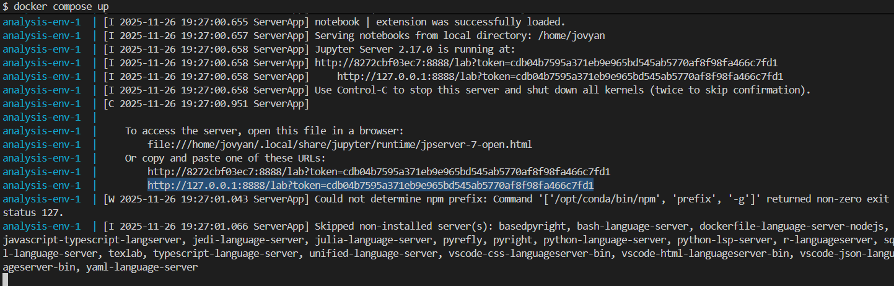

# Heart-Disease-Predictor---Group16

Authors: Shrabanti Bala Joya, Sarisha Das, Omowunmi Obadero, Mantram Sharma

## About

Here we attempt to build a classification model to predict whether an individual is at risk of a heart disease. The dataset contains 1000 unique examples and 14 features containing information on the individuals cholesterol, blood pressure, fasting blood sugar, etc. Our target column contains binary encoding where 1 translates to 'heart disease' and 0 to 'no heart disease'.

We performed exploratory data analysis (EDA) and applied SciKit Learn's preprocessing tools such as StandardScaler, OneHotEncoder and Ordinal encoder to preprocess the data based on the EDA. We built four different models - Decision Tree, Support Vector Machine (SVM) with Radial Basis Function (RBF) kernel, Logistic Regression and a Dummy Classifier. We used the Dummy Classifier as the baseline and compared cross-validation scores achieved from the other three models. The Support Vector Machine (Classifier) performed reasonably well than the other models with 0.98 test accuracy with recall = 1.0 and precision = 0.97.

It is imperative to ensure accurate diagnosis of heart disease based on a individuals clinical features. Among the evaluated models, we believe that the Support Vector Machine with RBF Kernel will yield the most reliable results as reflected in it's overall performance.

The [dataset](https://github.com/sjbalagit/Heart-Disease-Predictor---Group16/tree/main/data/raw/Cardiovascular_Disease_Dataset) used in this project has been obtained from [`Mendeley Data`](https://data.mendeley.com/datasets/dzz48mvjht/1). A detailed explanation of all the important features are provided in our analysis. You can find the raw and processed datasets in the data directory of this repository. Our X_train and X_test are represented in X_train.csv and X_test.csv respectively.

## Dependencies
- [Docker](https://www.docker.com/)

## Report

The final report can be found in our [analysis](https://github.com/sjbalagit/Heart-Disease-Predictor---Group16/blob/main/heart_disease_analysis.ipynb).

## Usage (Attributed from Breast-Cancer-Predictor Project README)

### Setup

> If you are using Windows or Mac, make sure Docker Desktop is running.

1. Clone this GitHub repository.

### Running the analysis

1. Navigate to the root of this project on your computer using the command line and enter the following command:

```
docker compose up
```

2. In the terminal, look for a URL that starts with `http://127.0.0.1:8888/lab?token=` (for an example, see the highlighted text in the terminal below). Copy and paste that URL into your browser.



3. To run the analysis, open `./heart_disease_analysis.ipynb` in Jupyter Lab you just launched and under the "Kernel" menu click "Restart Kernel and Run All Cells...".

### Clean up

To shut down the container and clean up the resources, type `Ctrl + C` in the terminal where you launched the container, and then type

```
docker compose rm
```

## Developer notes
### Developer dependencies
- `conda (version 23.9.0 or higher)`
- `conda-lock (version 2.5.7 or higher)`

### Adding a new dependency
1. Add the dependency to the `environment.yml` file on a new branch.

2. To update the conda-linux-64.lock file run the following. 
```
conda-lock -k explicit --file environment.yml -p linux-64
``` 

3. Re-build the Docker image locally to ensure it builds and runs properly.

4. Push the changes to GitHub. A new Docker image will be built and pushed to Docker Hub automatically. It will be tagged with the SHA for the commit that changed the file.

5. Update the docker-compose.yml file on your branch to use the new container image (make sure to update the tag specifically).

6. Send a pull request to merge the changes into the main branch.

## Running without Docker

### Dependencies

- conda (version 23.9.0 or higher)
- conda-lock (version 2.5.7 or higher)
- jupyterlab (version 4.0.0 or higher)
- nb_conda_kernels (version 2.3.1 or higher)
- Python and packages listed in environment.yml

### To run locally using anaconda environmet
If this is your first time running this project, then run the following from the root of this repository:

```
conda-lock install --name YOURENV conda-lock.yml
```

Replace `YOURENV` with the name of the conda environment you want to create.
To run the analysis, run the following from the root of this repository:

```
jupyter lab
```

Open `heart_disease_analysis.ipynb` in Jupyter Lab and under Switch/Select Kernel choose "Python [conda env:YOURENV]".

Next, under the "Kernel" menu click "Restart Kernel and Run All Cells...".

## References

Ttimbers. (n.d.). TTIMBERS/breast-cancer-predictor. GitHub. <https://github.com/ttimbers/breast-cancer-predictor/tree/main?tab=readme-ov-file>

Doppala, B. P., & Bhattacharyya, D. (2021, April 16). Cardiovascular Disease Dataset (Version 1) [Data Set]. Mendeley Data. <https://doi.org/10.17632/dzz48mvjht.1>
